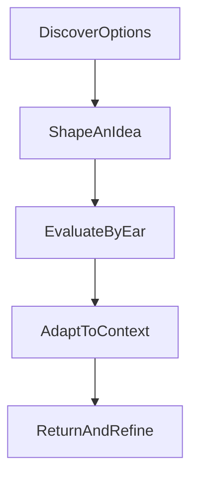

# Architecture At A Glance

This page is intentionally abstract.

Its purpose is to show the product's capability shape, not its internal system design.

## Capability View

## What This Diagram Means

### Discover Options
The product helps the user move from a rough musical instinct toward a smaller set of promising directions.

### Shape An Idea
Once something feels usable, the product supports turning it into a progression or fragment worth keeping.

### Evaluate By Ear
The experience includes fast musical feedback so the user can judge ideas in practice rather than relying only on theory or memory.

### Adapt To Context
The workflow stays useful across different writing contexts, including variations in how the player approaches the instrument.

### Return And Refine
Good tools support iteration. The product is meant to help players revisit and improve ideas rather than lose them.

## What This Page Avoids On Purpose
- internal systems
- production boundaries
- data flow details
- component naming
- implementation logic

If this page ever starts to read like a system map, it should be simplified or removed.
