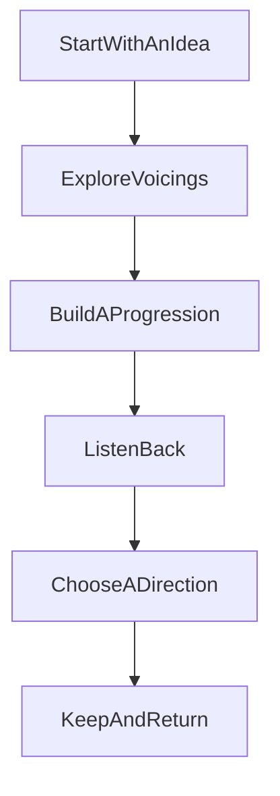

# Product Overview

## What GuitarGuide Does
GuitarGuide helps guitar players explore chords, build progressions, hear ideas back, and keep songwriting momentum.

The product is built around a practical problem: good musical ideas are often fragile. A player may hear a promising shape or progression, but the path from that first spark to something worth keeping is usually broken across too many tools and too much friction.

GuitarGuide tries to reduce that friction.

## Who It Is For
GuitarGuide is for:
- guitar players who write by exploring
- songwriters who think in chords and movement
- players who compare voicings rather than settle quickly
- people who work in alternate tunings as part of their normal writing process

It is especially useful for players who want to stay in a creative loop rather than switch constantly between reference, memory, and rough notes.

## What Makes It Distinct
GuitarGuide is not positioned as a broad music app. Its value comes from focus.

That focus shows up in four ways:
- chord exploration is tied to writing, not just lookup
- progressions are treated as the center of the workflow
- playback exists to support judgment, not just demonstration
- tuning context is part of the experience rather than a side feature

## Product Thesis
The central product belief is simple: speed to musical feedback matters more than theoretical completeness.

If a tool helps a player hear, compare, and keep ideas quickly, it is doing the right job. If it adds complexity without improving creative momentum, it is probably moving in the wrong direction.

## Core User Journey

## What The Product Is Not
GuitarGuide is not trying to be:
- a tab library
- a lesson platform
- a notation-first composition tool
- a large all-in-one music workspace

The restraint is part of the product quality.

## Why That Matters
Many music tools lose clarity by trying to satisfy every adjacent use case. GuitarGuide takes the opposite approach. It narrows scope so the experience can feel faster, more musical, and easier to trust.
