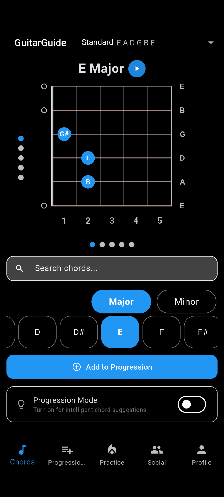
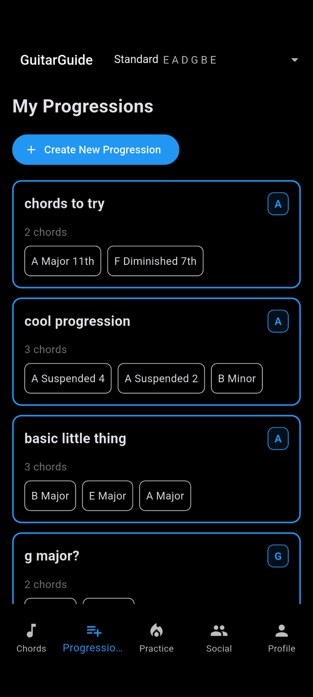
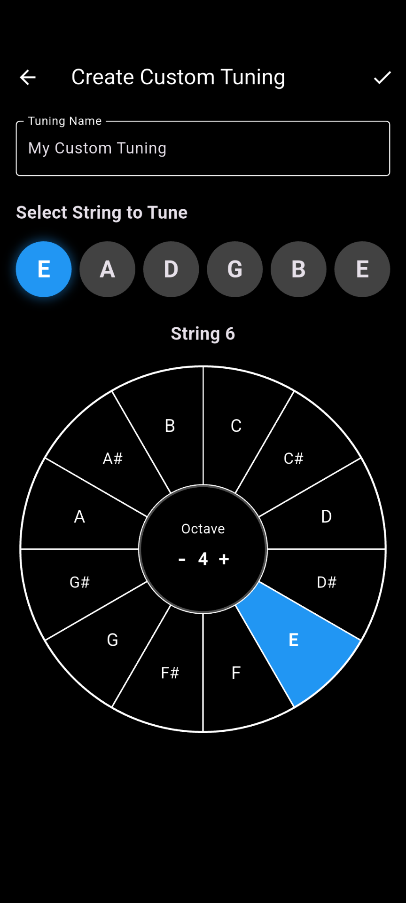

# GuitarGuide

GuitarGuide is a songwriting tool for guitar players designed to help ideas turn into real progressions quickly and without friction.

This repository is a curated public case study. It is designed to show product thinking, UX judgment, and engineering taste behind GuitarGuide without exposing proprietary implementation details.

The core idea: reduce the gap between hearing something in your head and actually building it.

Website: [guitarguide.app](https://guitarguide.app/)  
App Store: [Download on iOS](https://apps.apple.com/us/app/guitarguide/id6753149461)  
Google Play: [Download on Android](https://play.google.com/store/apps/details?id=app.guitarguide.mobile)

## Preview

  
  
  

## What GuitarGuide Is
GuitarGuide is built around a simple idea: songwriting tools should help players stay in motion. Instead of jumping between chord charts, notes, and voice memos, GuitarGuide keeps chord exploration, progression building, playback, and tuning-aware writing in one focused workflow.

The app is intentionally narrow. It is not trying to be a tab library, a lesson platform, or a general-purpose music suite. It is designed for players who write by exploring and want less friction between hearing an idea and keeping it.

## Why This Repo Exists
This repository exists to document the thinking behind the product, not to publish the product itself.

It serves three purposes:
- portfolio centerpiece
- product and engineering case study
- a quiet marketing surface for the app

## Product At A Glance
- Chord exploration focused on quickly finding voicings that actually sound usable
- Progression-building tools centered on capturing ideas before they disappear
- Playback that supports decision-making during writing
- Tuning-aware workflows for players who write beyond standard tuning
- A premium tier designed to expand creative depth without interrupting flow

## Product Workflow

## What This Repo Covers
- product overview and principles
- key design decisions and tradeoffs
- UX notes and workflow thinking
- a high-level capability view of the product

## What This Repo Does Not Cover
- private source code
- production folder structure
- proprietary progression or suggestion logic
- monetization mechanics
- analytics implementation details
- internal architecture mapped closely enough to rebuild the app

## Start Here
If you're exploring this repo for the first time:

- [`PRODUCT_OVERVIEW.md`](PRODUCT_OVERVIEW.md)
- [`PRINCIPLES.md`](PRINCIPLES.md)
- [`CASE_STUDY.md`](CASE_STUDY.md)
- [`DESIGN_DECISIONS.md`](DESIGN_DECISIONS.md)
- [`UX_NOTES.md`](UX_NOTES.md)
- [`ARCHITECTURE_AT_A_GLANCE.md`](ARCHITECTURE_AT_A_GLANCE.md)
- [`REPOSITORY_SCOPE.md`](REPOSITORY_SCOPE.md)
- [`PUBLISHING_CHECKLIST.md`](PUBLISHING_CHECKLIST.md)
